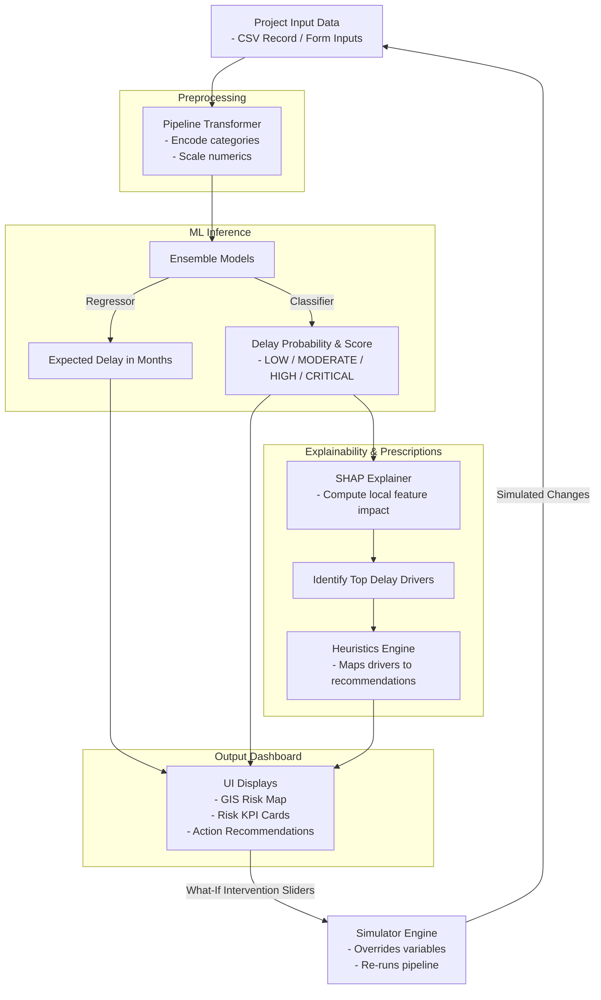

# LandRisk AI: Tech Stack & Workflow

This document outlines the core technology stack and the operational workflow of the **LandRisk AI** platform.

---

## 🛠️ Technology Stack

* **Frontend Dashboard**: Streamlit (Python web application framework)
* **Styling**: HTML5 and custom CSS (for UI cards and alert formats)
* **Data Processing**: Pandas and NumPy
* **Machine Learning**: Scikit-Learn (Random Forest Classifier & Regressor, StandardScaler, and OneHotEncoder)
* **Model Explainability**: SHAP (Shapley Additive exPlanations)
* **GIS Map Layer**: PyDeck (interactive mapping)
* **Analytics Visualizations**: Plotly (interactive charts)
* **Model Storage**: Joblib (for model serialization and loading)
* **Data Layer**: Local CSV Files (for project logs)

---

## 🔄 Operational Workflow (Input to Output)

Below is the workflow of how project data travels through the LandRisk AI pipeline, from raw inputs to predictions, explanations, and intervention simulations:

